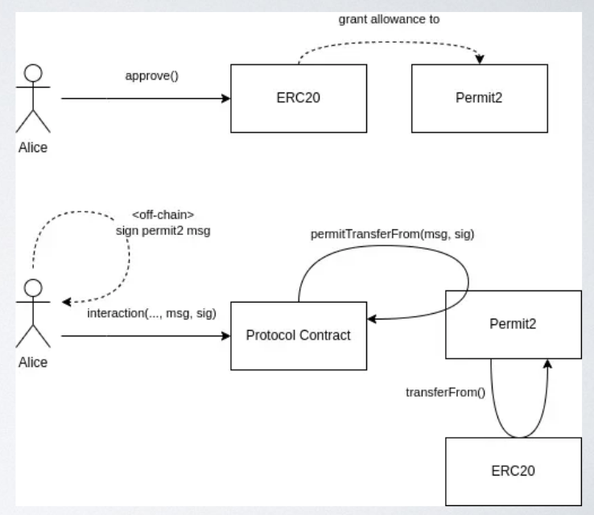
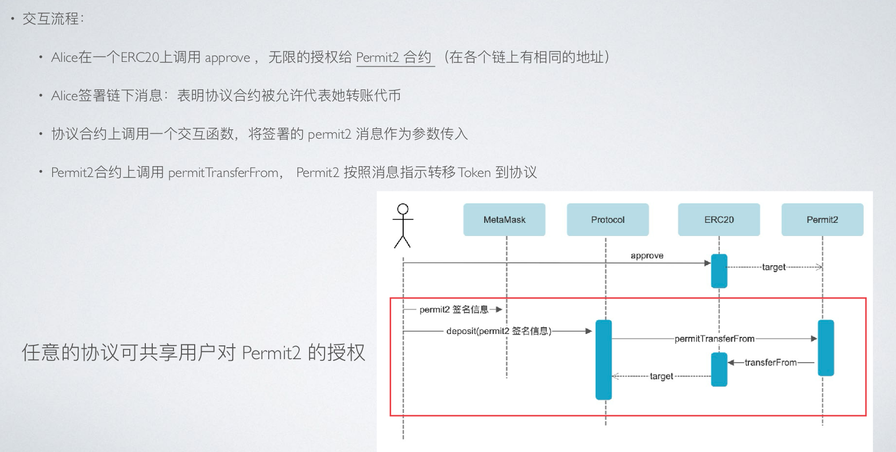

### 基础知识

**ERC20 Permit（EIP-2612） VS Permit2（Uniswap）**

- Permit：Ethereum 官方 EIP-2612，实现自 OpenZeppelin 的 ERC20Permit
    - 作用：允许用户通过 离线签名，授权某个 spender 可以使用一定额度的代币，而无需先在链上执行 approve 交易。
    - 示意流程：
        - 用户签名生成 Permit 消息（链下）
        - 调用合约 permit() 函数
        - 合约内部更新 allowance(owner, spender)
        - 调用 transferFrom 执行转账
    - 局限性：
        - 只能针对单个代币和单个 spender
        - 每次转账前仍需调用 permit（或者必须在一次交易里结合 transferFrom）

- Permit2：Uniswap 官方，解决 EIP-2612 的一些限制，实现自 Uniswap 的 Permit2 合约
    - 作用：提供 更通用的授权机制，允许：1）一次签名授权 多次转账；2）可跨多个代币；可设置更灵活的 allowance（例如无限期或部分额度）
    - 示意流程：
        - 用户签名生成 Permit2 消息（链下）
        - 合约调用 Permit2 合约验证签名并授权
        - 调用 Permit2 合约的 transferFrom 执行转账
        - 可以多次使用同一授权（根据额度和期限）
- 简单理解：
    - ERC20 Permit = “一次性单 token 授权”
    - Permit2 = “高级通用授权，可以重复/批量操作”


| 特性          | EIP-2612 `permit` | Uniswap `Permit2`            |
| ----------- | ----------------- | ---------------------------- |
| 支持 token 数量 | 单个代币              | 多个代币                         |
| 支持 spender  | 单个 spender        | 多个 spender                   |
| 签名使用        | 每次授权需要签名          | 可重复使用，支持批量                   |
| 应用场景        | 简化单笔交易            | 高级 DEX / 钱包交互，MetaTx，Gasless |
| 合约复杂度       | 简单，ERC20 内置       | 独立合约，需部署 Permit2             |


**Permit2 能做什么**
- Permit2 是一个代币授权合约，通过引入基于签名的授权和转移来迭代现有的代币授权机制，适用于任何 ERC20 代币，无论是否支持 EIP-2612。
- 对于每个代币，用户必须提交一次传统的授权，将 Permit2合约 设置为授权的支出者。与 Permit2 集成的合约可以“借用”用户在规范 Permit2 合约上授权的任何代币的支出者状态。任何集成的合约都可以通过签署的链下 Permit2 消息暂时成为支出者。这有效地“共享”了一次性的传统代币授权，并跳过了每个支持 Permit2 的协议的单独授权交易——直到 Permit2 消息过期。
    - 任何代币的授权。应用程序可以通过发送签名和交易数据来实现单一交易流程，包括那些不支持原生permit方法的代币。
    - 过期的授权。授权可以是有时间限制的，消除对钱包整个代币余额的悬挂授权的安全担忧。撤销授权不一定需要是新的交易。
    - 基于签名的转移。用户可以通过一次性签名将代币释放给有权限的支出者，从而完全绕过设置额度。
    - 批量授权和转移。用户可以在一个交易中设置多个代币的授权或执行多个转移。
    - 批量撤销额度。在一个交易中移除任意数量的代币和支出者的额度。

**Permit2核心流程**





**总结流程**
- 用户 approve(MyToken → Permit2)，让 Permit2 能代为转账。
- 用户 离线签名（EIP-712，包含 token、amount、spender、nonce、deadline）。
- 用户调用 TokenBank.depositWithPermit2(...)，把签名和参数交给银行。
- TokenBank → 调 Permit2 → 检查签名有效 → 转账 MyToken（因为Permit2已有token的最大授权） → 存入银行。
- 最终，用户在 TokenBank 中的余额增加


#####  题目#1
- 在原来的 TokenBank 添加一个方法 depositWithPermit2()， 这个方式使用 permit2 进行签名授权转账来进行存款。（在本地环境需要大家先部署 Permit2 合约）
- 测试通过 permit2 的签名存款。（题目作出了修改）
    - 原来题目：修改 Token 存款前端 让用户可以在前端通过 permit2 的签名存款。

**题目分析**
- 主要是需要使用Permit2来完成离线授权，增加 depositWithPermit2() 方法来实现功能
- 这里使用的时候遇到了一些问题，主要是forge test时后边没有指定anvil网络造成的，所以为了验证对错我直接错了三网络的使用方式，对应下边的三个实现。


**实现1-使用官方sepolia网络上的Permit2（见项目c01）**
- 创建项目：
    - mkdir c01 && cd c01
    - forge init --no-git
    - 生成 Remappings: forge remappings > remappings.txt
    - wget https://github.com/OpenZeppelin/openzeppelin-contracts/archive/refs/heads/master.zip -O oz.zip
        - unzip oz.zip -d lib/
        - mv lib/openzeppelin-contracts-master lib/openzeppelin-contracts
        - rm oz.zip
    - wget https://github.com/Uniswap/permit2/archive/refs/heads/main.zip -O permit2.zip
        - unzip permit2.zip -d lib/
        - mv lib/permit2-main lib/permit2
        - rm permit2.zip
    - wget https://github.com/transmissions11/solmate/archive/refs/heads/main.zip -O solmate.zip
        - unzip solmate.zip -d lib/
        - mv lib/solmate-main lib/solmate
        - rm solmate.zip
    - 生成 Remappings: forge remappings > remappings.txt

- sepolia测试网的 Permit2 合约地址：0x000000000022D473030F116dDEE9F6B43aC78BA3

- 编写TokenBank

- 编写测试合约TokenBankTest
    - 因为Permit2是在sepolia上，所以测试的时候也要fork在sepolia上进行
    - forge test --fork-url $SEPOLIA_RPC_URL

**实现2-sepolia网络上自己部署Permit2（见项目c02）**
- 创建项目：
    - mkdir c02 && cd c02
    - forge init --no-git
    - 生成 Remappings: forge remappings > remappings.txt
    - wget https://github.com/OpenZeppelin/openzeppelin-contracts/archive/refs/heads/master.zip -O oz.zip
        - unzip oz.zip -d lib/
        - mv lib/openzeppelin-contracts-master lib/openzeppelin-contracts
        - rm oz.zip
    - wget https://github.com/Uniswap/permit2/archive/refs/heads/main.zip -O permit2.zip
        - unzip permit2.zip -d lib/
        - mv lib/permit2-main lib/permit2
        - rm permit2.zip
    - wget https://github.com/transmissions11/solmate/archive/refs/heads/main.zip -O solmate.zip
        - unzip solmate.zip -d lib/
        - mv lib/solmate-main lib/solmate
        - rm solmate.zip
    - 生成 Remappings: forge remappings > remappings.txt

- 在sepolia上部署Permit2
    - 部署脚本：DeployPermit2.s.sol
    ```bash
    forge script script/DeployPermit2.s.sol:DeployPermit2Script \
    --rpc-url $SEPOLIA_RPC_URL \
    --private-key $SEPOLIA_PRIVATE_KEY \
    --broadcast \
    --verify \
    --etherscan-api-key $ETHERSCAN_API_KEY \
    -vvvv
    ```
    - 部署地址：0x9681ecEa46960107877F4268437d1161a2A46f4c

- 把c01中的src与test拷贝过来，其中的PERMIT2_ADDRESS地址修改为：0x9681ecEa46960107877F4268437d1161a2A46f4c

- 测试：forge test --fork-url $SEPOLIA_RPC_URL
    - 通过

**实现3-anvil网络上自己部署Permit2（见项目c03）**
- 创建项目：
    - mkdir c03 && cd c03
    - forge init --no-git
    - 生成 Remappings: forge remappings > remappings.txt
    - wget https://github.com/OpenZeppelin/openzeppelin-contracts/archive/refs/heads/master.zip -O oz.zip
        - unzip oz.zip -d lib/
        - mv lib/openzeppelin-contracts-master lib/openzeppelin-contracts
        - rm oz.zip
    - wget https://github.com/Uniswap/permit2/archive/refs/heads/main.zip -O permit2.zip
        - unzip permit2.zip -d lib/
        - mv lib/permit2-main lib/permit2
        - rm permit2.zip
    - wget https://github.com/transmissions11/solmate/archive/refs/heads/main.zip -O solmate.zip
        - unzip solmate.zip -d lib/
        - mv lib/solmate-main lib/solmate
        - rm solmate.zip
    - 生成 Remappings: forge remappings > remappings.txt

- 在anvil上部署Permit2
    - 部署脚本：DeployPermit2.s.sol
    ```bash
    forge script script/DeployPermit2.s.sol:DeployPermit2Script \
    --rpc-url $LOCAL_RPC_URL \
    --private-key $LOCAL_PRIVATE_KEY \
    --broadcast \
    -vvvv
    ```
    - 部署地址：0x5FbDB2315678afecb367f032d93F642f64180aa3

- 把c01中的src与test拷贝过来，其中的PERMIT2_ADDRESS地址修改为：0x5FbDB2315678afecb367f032d93F642f64180aa3

- 测试：forge test --fork-url $LOCAL_RPC_URL
    - 通过，测试通过说明执行没问题，接下来就可以将上边的合约部署在anvil上，然后使用前端来请求存款了

- **forge test的一些知识**
    - 使用过程中：
        - forge test --fork-url $LOCAL_RPC_URL 可以通过
        - forge test 不可通过
    - 原因如下：
        - forge test 的默认行为：直接运行 forge test，Forge 会默认启动一个临时的本地测试链（anvil-like），并在内存中部署你的合约。也就是说，这个链是干净的、没有任何外部合约的历史状态。
            - 所以启动anvil之后，部署了Permit2合约，但是当我执行forge test时不可通过；
            - 因为forge test启动一个临时的本地测试链中并没有我部署的Permit2合约

- 在anvil上部署MyToken
    - 部署脚本：MyToken.s.sol
    ```bash
    forge script script/MyToken.s.sol:DeployMyTokenScript \
    --rpc-url $LOCAL_RPC_URL \
    --private-key $LOCAL_PRIVATE_KEY \
    --broadcast \
    -vvvv
    ```
    - 部署地址：0xe7f1725E7734CE288F8367e1Bb143E90bb3F0512，地址写入 TokenBank.s.sol 中

- 在anvil上部署TokenBank
    - 部署脚本：TokenBank.s.sol
    ```bash
    forge script script/TokenBank.s.sol:DeployTokenBankScript \
    --rpc-url $LOCAL_RPC_URL \
    --private-key $LOCAL_PRIVATE_KEY \
    --broadcast \
    -vvvv
    ```
    - 部署地址：0x9fE46736679d2D9a65F0992F2272dE9f3c7fa6e0

- 创建前端脚本：
    - mkdir viem_front && cd viem_front
    - npm init -y
    - npm install viem ethers
    - 用 TypeScript，再加：
        - npm install -D typescript ts-node @types/node
        - npx tsc --init
    - mkdir src && touch src/viem_test.ts
        - 写入内容    
    - 进入src运行：npx ts-node viem_test.ts


**总结流程**
- 用户 approve(MyToken → Permit2)，让 Permit2 能代为转账。
- 用户 离线签名（EIP-712，包含 token、amount、spender、nonce、deadline）。
- 用户调用 TokenBank.depositWithPermit2(...)，把签名和参数交给银行。
- TokenBank → 调 Permit2 → 检查签名有效 → 转账 MyToken（因为Permit2已有token的最大授权） → 存入银行。
- 最终，用户在 TokenBank 中的余额增加

